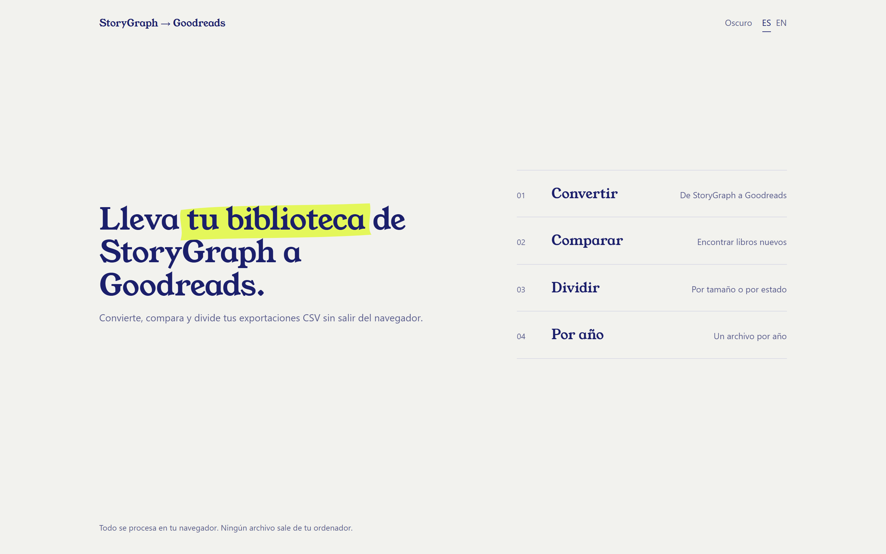
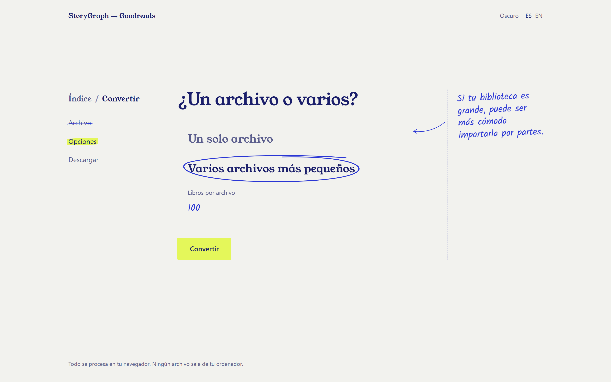
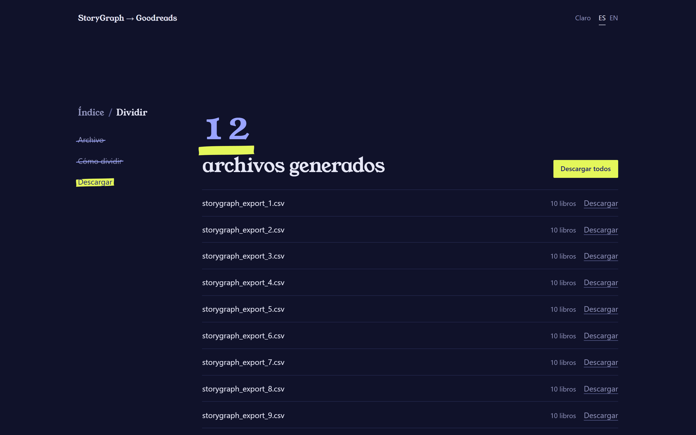

# StoryGraph → Goodreads

**Lleva tu biblioteca de libros de StoryGraph a Goodreads, directamente en tu navegador.**

### [Abrir la app](https://rinsdoc.github.io/storygraph_to_goodreads/)

Gratis · Sin cuentas · Nada sale de tu ordenador

[English](README.md) · **Español**

  

Una pequeña app web que convierte tu exportación CSV de [StoryGraph](https://thestorygraph.com) en un archivo que [Goodreads](https://www.goodreads.com/review/import) puede importar, además de herramientas para comparar bibliotecas, dividir archivos grandes y ordenar tu biblioteca por años.

Sin cuentas, sin instalar nada y sin servidor: **todos los archivos se procesan en tu navegador y nunca salen de tu ordenador.**

## Cómo migrar tu biblioteca

1. **Exporta desde StoryGraph.** En tu cuenta de StoryGraph, ve a [Manage Data](https://app.thestorygraph.com/user-export) y descarga la exportación CSV.
2. **Conviértela.** [Abre la app](https://rinsdoc.github.io/storygraph_to_goodreads/), elige **Convertir**, carga el CSV, decide si quieres un archivo o varios más pequeños y pulsa *Convertir*.
3. **Descarga el resultado.** Obtienes `goodreads_import.csv`, o varias partes numeradas si elegiste varios archivos.
4. **Impórtalo en Goodreads** en [goodreads.com/review/import](https://www.goodreads.com/review/import).

¿Ya migraste una vez? La próxima, usa **Comparar** con tu nueva exportación de StoryGraph y tu exportación actual de Goodreads para importar solo los libros que aún no tienes.

## Las cuatro herramientas

| Herramienta | Qué hace |
| --- | --- |
| **Convertir** | Pasa una exportación de StoryGraph al formato de importación de Goodreads: estanterías, fechas, valoraciones, ISBN y reseñas incluidas. También puede dividir el resultado en archivos más pequeños. |
| **Comparar** | Se queda solo con los libros de un archivo nuevo que *no* están en tu biblioteca actual, comparando por ISBN, o por título y autor. Funciona igual con exportaciones de StoryGraph y de Goodreads. |
| **Dividir** | Corta un CSV grande en partes de tamaño fijo, o en un archivo por estado de lectura (`read`, `to-read`, `currently-reading`…). |
| **Por año** | Crea un archivo por cada año de tu biblioteca, o solo el del año que elijas. |

Todas funcionan igual, una pantalla cada vez: eliges el archivo, decides las opciones y descargas el resultado.

## Capturas

  
  

## Qué se convierte

| Columna de StoryGraph | Columna de Goodreads | Notas |
| --- | --- | --- |
| `Title` | `Title` | Tal cual |
| `Authors` | `Author`, `Author l-f` | La forma *apellido, nombre* toma la última palabra como apellido |
| `Read Status` | `Exclusive Shelf`, `Bookshelves` | `read` y `currently-reading` mantienen su estantería; lo demás va a `to-read` |
| `Date Added` | `Date Added` | La fecha de hoy si falta o no se puede leer |
| `Last Date Read` | `Date Read` | Solo para libros en la estantería `read`; la fecha de hoy si falta |
| `Star Rating` | `My Rating` | Redondeada hacia abajo a estrellas enteras (`3.75` → `3`), porque en Goodreads las valoraciones son de estrellas enteras |
| `ISBN/UID` | `ISBN` o `ISBN13` | Según la longitud (10 o 13 dígitos); otros identificadores, como los ASIN, se descartan |
| `Format` | `Binding` | Tal cual |
| `Review` | `My Review` | Tal cual |
| `Read Count` | `Read Count` | Número entero no negativo |
| `Owned?` | `Owned Copies` | `yes`, `true`, `y` o `1` → `1`; cualquier otra cosa → `0` |

Las fechas se leen en `YYYY-MM-DD`, `YYYY/MM/DD`, `DD/MM/YYYY` o `Month D, YYYY`, y se escriben en el formato `YYYY/MM/DD` que espera Goodreads.

## Preguntas

**¿Se suben mis archivos a algún sitio?**
No. Tus archivos los abre, convierte y guarda tu propio navegador: **nunca se envían a ningún sitio**. No hay un servidor detrás de la app, ni cuentas, ni seguimiento, y la página no carga nada de terceros, ni siquiera las fuentes. Una vez cargada, podrías desconectarte de internet y seguiría funcionando.

**Algunos libros leídos aparecen en Goodreads con la fecha de hoy.**
StoryGraph no tenía fecha de lectura para ellos, así que la conversión pone el día en que conviertes para que sigan en la estantería `read` con una fecha. Puedes cambiarla después en Goodreads.

**Goodreads tiene problemas con mi archivo grande.**
Divídelo e importa las partes una a una: elige *Varios archivos más pequeños* en **Convertir**, o usa **Dividir** con un archivo que ya tengas.

**¿Cómo evito duplicados si vuelvo a migrar?**
Usa **Comparar** con tu nueva exportación de StoryGraph como archivo nuevo y tu exportación de Goodreads como biblioteca actual. Obtienes un CSV solo con los libros que faltan, listo para convertir.

**¿En qué año cae cada libro en Por año?**
En cada año en que lo añadiste o lo leíste, así que puede aparecer en más de un archivo. Los libros sin ninguna fecha van a `unknown`.

## Sobre este proyecto

No tengo ninguna relación con StoryGraph ni con Goodreads. Hice esta app porque quería pasar mi historial de lectura de una a otra, y sus nombres aparecen aquí solo para explicar qué hace.

---

¿Quieres ejecutarla en tu ordenador o ayudar a mejorarla? Mira [DEVELOPMENT.es.md](DEVELOPMENT.es.md).
