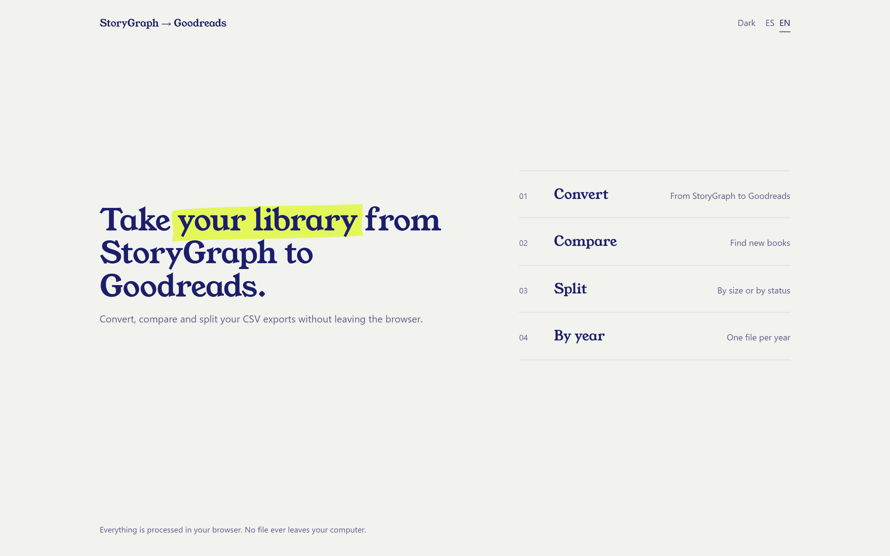
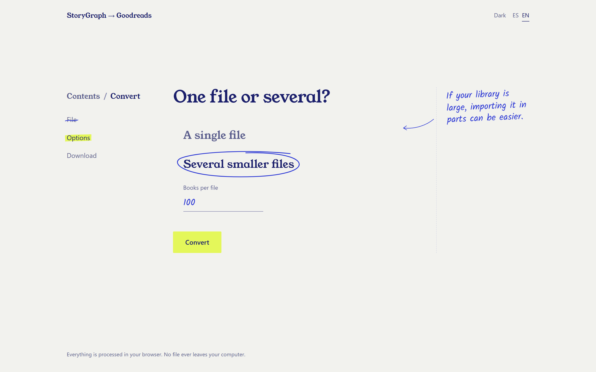
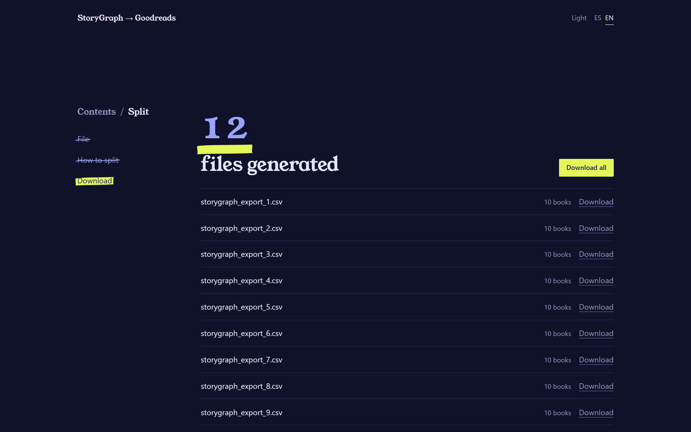

# StoryGraph → Goodreads

**Move your book library from StoryGraph to Goodreads, right in your browser.**

### [Open the app](https://rinsdoc.github.io/storygraph_to_goodreads/)

Free · No account · Nothing leaves your computer

**English** · [Español](README.es.md)

  

A small web app that turns your [StoryGraph](https://thestorygraph.com) CSV export into a file [Goodreads](https://www.goodreads.com/review/import) can import, plus tools to compare libraries, split large files and sort your library by year.

No account, no install, no server: **every file is processed in your browser and never leaves your computer.**

## How to migrate your library

1. **Export from StoryGraph.** In your StoryGraph account, go to [Manage Data](https://app.thestorygraph.com/user-export) and download the CSV export.
2. **Convert it.** [Open the app](https://rinsdoc.github.io/storygraph_to_goodreads/), choose **Convert**, load the CSV, pick one file or several smaller ones, and press *Convert*.
3. **Download the result.** You get `goodreads_import.csv`, or numbered parts if you chose several files.
4. **Import into Goodreads** at [goodreads.com/review/import](https://www.goodreads.com/review/import).

Already migrated once? Next time, run **Compare** with your new StoryGraph export and your current Goodreads export to import only the books you don't have yet.

## The four tools

| Tool | What it does |
| --- | --- |
| **Convert** | Turns a StoryGraph export into the Goodreads import format: shelves, dates, ratings, ISBN and reviews included. It can also split the result into smaller files. |
| **Compare** | Keeps only the books from a new file that are *not* in your existing library, matching by ISBN, or by title and author. Works with StoryGraph and Goodreads exports alike. |
| **Split** | Cuts a large CSV into parts of a fixed size, or into one file per reading status (`read`, `to-read`, `currently-reading`…). |
| **By year** | Creates one file per year of your library, or only the file for the year you choose. |

Each tool works the same way, one screen at a time: pick the file, choose the options, download the result.

## Screenshots

  
  

## What gets converted

| StoryGraph column | Goodreads column | Notes |
| --- | --- | --- |
| `Title` | `Title` | As is |
| `Authors` | `Author`, `Author l-f` | The *last name, first names* form uses the last word as the surname |
| `Read Status` | `Exclusive Shelf`, `Bookshelves` | `read` and `currently-reading` keep their shelf; anything else goes to `to-read` |
| `Date Added` | `Date Added` | Today's date if missing or unreadable |
| `Last Date Read` | `Date Read` | Only for books on the `read` shelf; today's date if missing |
| `Star Rating` | `My Rating` | Rounded down to whole stars (`3.75` → `3`), since Goodreads ratings are whole stars |
| `ISBN/UID` | `ISBN` or `ISBN13` | Chosen by length (10 or 13 digits); other IDs, such as ASINs, are left out |
| `Format` | `Binding` | As is |
| `Review` | `My Review` | As is |
| `Read Count` | `Read Count` | Whole, non-negative number |
| `Owned?` | `Owned Copies` | `yes`, `true`, `y` or `1` → `1`; anything else → `0` |

Dates are read as `YYYY-MM-DD`, `YYYY/MM/DD`, `DD/MM/YYYY` or `Month D, YYYY`, and written in the `YYYY/MM/DD` format Goodreads expects.

## Questions

**Are my files uploaded anywhere?**
No. Your files are opened, converted and saved by your own browser: **they are never sent anywhere**. There is no server behind the app, no account and no tracking, and the page doesn't load anything from third parties, not even fonts. Once it has loaded, you could disconnect from the internet and it would keep working.

**Some of my read books show today's date in Goodreads.**
StoryGraph had no read date for them, so the conversion fills in the day you convert to keep them on the `read` shelf with a date. You can edit it in Goodreads afterwards.

**Goodreads has trouble with my large file.**
Split it and import the parts one by one: choose *Several smaller files* in **Convert**, or use **Split** on a file you already have.

**How do I avoid duplicates when I migrate again?**
Use **Compare** with your new StoryGraph export as the new file and your Goodreads export as your current library. You get a CSV with only the missing books, ready to convert.

**Where does a book go in By year?**
In every year in which it was added or read, so it can appear in more than one file. Books with no dates at all go to `unknown`.

## About this project

I'm not connected to StoryGraph or Goodreads in any way. I built this because I wanted to move my own reading history from one to the other, and their names only appear here to explain what the app does.

---

Want to run it on your own computer or help improve it? See [DEVELOPMENT.md](DEVELOPMENT.md).
